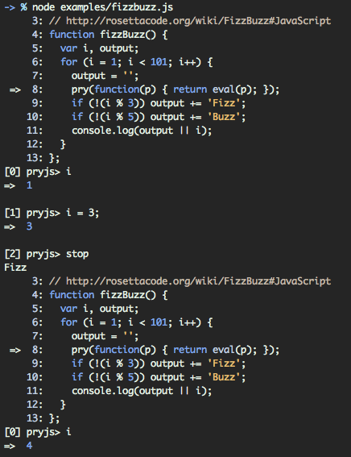
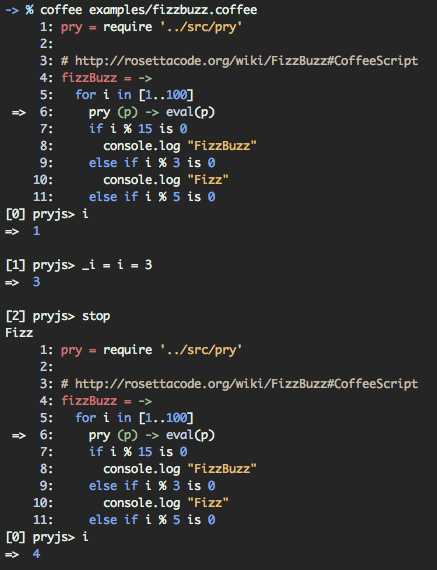

## Pryjs

A prototype for a [pry](https://github.com/pry/pry)-like node module.

### Installing

~~~
npm install --save pryjs
~~~

### Usage

Throw this beautiful snippet in the middle of your code:

~~~ javascript
pry = require('pryjs')
eval(pry.it)
~~~

### Extra Commands

While you are in the prompt there are a few things you might want to do:
* `whereami` will show you exactly where you are in the code. Accepts two integers to replace the default 5 before and 5 after.
* `stop` will exit the pryjs prompt and continue through the app.
* `kill` completely stop the script.
* `wtf` display the last caught exception.
* `version` display the current version.
* `mode` switch between javascript and coffeescript mode. Defaults to javascript.
* `help` display all the available commands.
* `play` play lines of code as if you had entered them. Accepts two integers: start and end. End defaults to start.

### Examples

Examples can be found in the [examples directory](./examples).

### Screenshots

