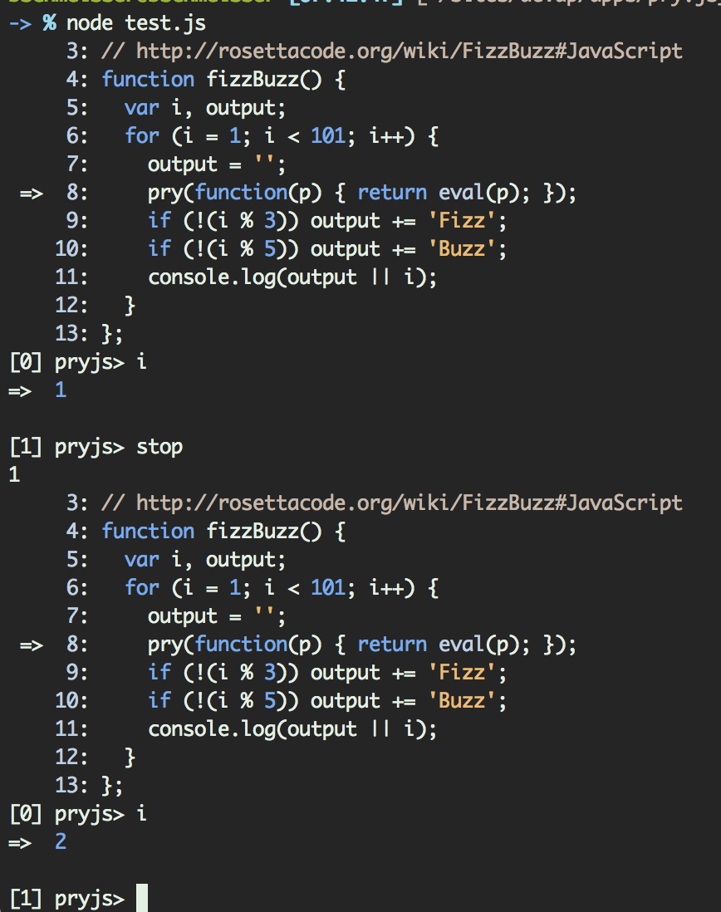

## Pryjs
A prototype for a [pry](https://github.com/pry/pry)-like node module.

### Usage
It's not as pretty, but you'll need to add the following to your code:

~~~ coffeescript
pry (p) -> eval p
~~~

~~~ javascript
pry(function(p) {
  return eval(p);
});
~~~

### Extra Commands
While you are in the prompt there are a few things you might want to do:
* `whereami` will show you exactly where you are in the code. Accepts two integers to replace the default 5 before and 5 after.
* `stop` will exit the pryjs prompt and continue through the app.
* `kill` completely stop the script.

### Installing
~~~
npm install --save pryjs
~~~

### Examples

Examples can be found in the [examples directory](./examples).
